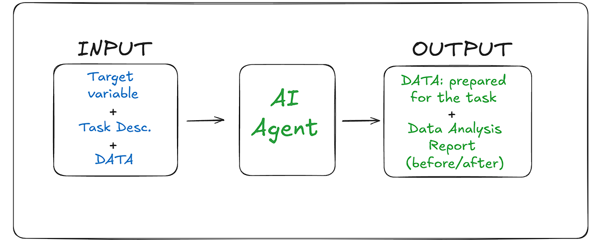

# Data Preprocessing AI Agent 📊🤖

This repository showcases the initial work of my AI Agent designed to automate data preprocessing for structured data, aiming to prepare it for machine learning tasks. 

## Motivation

Data preprocessing is often the most time-consuming and crucial stage in the machine learning pipeline. The quality of data at this step significantly impacts the accuracy and performance of models. With the rise of AI technologies, I’ve developed an AI Agent that automates this entire process, saving valuable time and improving the effectiveness of trained models.

Currently, the AI Agent is capable of performing the following tasks:

- **Data Analysis:** Automatically generate before/after reports comparing the dataset to provide insights on how preprocessing steps enhance data quality.
- **Data Reduction:** Detect and remove irrelevant columns or features that do not contribute meaningful information, reducing noise and improving model performance.
- **Handling Missing Data:** Choose and apply the best strategy for dealing with missing values, ensuring realistic data representation and consistency.
- **Data Normalization:** Scale features into a standard range to ensure accurate machine learning model interpretation.
- **Feature Engineering:** Create or refine features to provide better insights to models, improving their understanding of the task.
- **Data Standardization:** Standardize data to ensure consistency across all features, making it compatible with various machine learning algorithms.
- **Data Balancing:** Apply techniques to balance imbalanced datasets (e.g., oversampling, undersampling), improving model performance on underrepresented classes.

## About Agent AI

The AI Agent is still in early-stage testing. This repository will be regularly updated with new functionalities and features. Check back for updates on its capabilities and when it will be ready for public use.

If you:

- **Have suggestions on how to improve the Agent**: Feel free to email me at [adrian.blazeusz@gmail.com](mailto:adrian.blazeusz@gmail.com).📩
- **Like the idea**: Please leave a star to show your support! 🌟

**Stay tuned for more updates!**
I’ll be adding examples soon to provide a bigger picture.